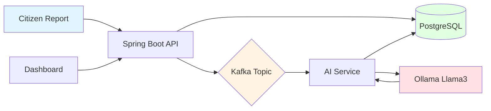

# 🏙️ CivicPulse - Smart City Incident Triage System

> **Real-time incident reporting powered by Spring Boot, Apache Kafka, and Local AI**

[](https://www.oracle.com/java/)
[](https://spring.io/projects/spring-boot)
[](https://kafka.apache.org/)
[](https://ollama.ai/)

CivicPulse is a modern, event-driven incident reporting system designed for smart cities. Citizens can report issues like potholes, broken streetlights, or sanitation problems, and the system automatically categorizes and prioritizes them using **local AI** - no expensive cloud APIs required!

---

## ✨ Key Features

- 🚀 **Real-time Processing** - Event-driven architecture with Apache Kafka
- 🤖 **AI-Powered Analysis** - Automatic categorization and priority assignment using Ollama (Llama3)
- 🔒 **Privacy-First** - Runs entirely locally, no data leaves your infrastructure
- 📊 **Live Dashboard** - Real-time updates as incidents are processed
- 🐳 **Docker-Ready** - One-command infrastructure setup
- 💰 **Cost-Effective** - No cloud API fees, runs on your hardware

---

## 🎯 How It Works



**Flow:**
1. Citizen submits incident report
2. API saves to database as `PENDING`
3. Event published to Kafka topic
4. AI Service consumes event
5. Ollama analyzes description
6. Status updated to `ANALYZED` with category & priority
7. Dashboard polls and displays results

---

## 🛠️ Tech Stack

| Component | Technology |
|-----------|-----------|
| **Backend** | Java 17, Spring Boot 3.2, Spring Data JPA |
| **Messaging** | Apache Kafka 3.6, Zookeeper |
| **AI/LLM** | Spring AI, Ollama (Llama3) |
| **Database** | PostgreSQL 15 |
| **Frontend** | Vanilla JavaScript, HTML5, CSS3 |
| **DevOps** | Docker, Docker Compose |

---

## 🚀 Quick Start

### Prerequisites

- **Docker Desktop** (for Kafka & PostgreSQL)
- **Java 17+** and **Maven**
- **Ollama** ([Install here](https://ollama.ai/))

### 1️⃣ Clone the Repository

```bash
git clone https://github.com/iam-ssrivastav/civic-pulse.git
cd civic-pulse
```

### 2️⃣ Start Infrastructure

```bash
docker-compose up -d
```

This starts:
- Kafka (port 9098)
- Zookeeper (port 2181)
- PostgreSQL (port 5432)

### 3️⃣ Setup AI Model

```bash
ollama pull llama3
ollama serve
```

### 4️⃣ Run Backend

```bash
cd backend
./mvnw spring-boot:run
```

Backend runs on `http://localhost:8080`

### 5️⃣ Open Dashboard

Open `frontend/index.html` in your browser.

---

## 🎬 Demo

### Submit an Incident


### AI Processing in Action
The system automatically:
- ✅ Categorizes (Infrastructure, Safety, Sanitation, Traffic)
- ✅ Assigns Priority (High, Medium, Low)
- ✅ Updates status to `ANALYZED`

### Live Dashboard


---

## 📁 Project Structure

```
civic-pulse/
├── backend/
│   ├── src/main/java/com/civicpulse/
│   │   ├── controller/      # REST API endpoints
│   │   ├── service/          # Business logic & AI integration
│   │   ├── event/            # Kafka listeners
│   │   ├── model/            # JPA entities
│   │   └── repository/       # Data access layer
│   └── pom.xml
├── frontend/
│   └── index.html            # Dashboard UI
├── docker-compose.yml        # Infrastructure setup
└── README.md
```

---

## 🔧 Configuration

### Application Properties

```properties
# Kafka
spring.kafka.bootstrap-servers=localhost:9098

# PostgreSQL
spring.datasource.url=jdbc:postgresql://localhost:5432/civicpulse

# Ollama AI
spring.ai.ollama.base-url=http://localhost:11434
spring.ai.ollama.chat.model=llama3
```

---

## 🧪 Testing the System

1. **Submit a Report**
   ```
   Description: "There is a massive pothole on Main Street causing traffic jams"
   ```

2. **Watch the Magic** ✨
   - Status: `PENDING` → `ANALYZED`
   - Category: `INFRASTRUCTURE`
   - Priority: `HIGH`

3. **Check Logs**
   ```bash
   # Backend logs show AI analysis
   AI Response: {"category": "INFRASTRUCTURE", "priority": "HIGH"}
   ```

---

## 🎯 Use Cases

- 🏗️ **Smart Cities** - Citizen-driven infrastructure monitoring
- 🚨 **Emergency Services** - Automated incident triage
- 🏢 **Facility Management** - Maintenance request handling
- 🌳 **Environmental Monitoring** - Pollution/waste reporting

---

## 🤝 Contributing

Contributions are welcome! Please:

1. Fork the repository
2. Create a feature branch (`git checkout -b feature/AmazingFeature`)
3. Commit changes (`git commit -m 'Add AmazingFeature'`)
4. Push to branch (`git push origin feature/AmazingFeature`)
5. Open a Pull Request

---

## 📝 License

This project is licensed under the MIT License - see the [LICENSE](LICENSE) file for details.

---

## 👨‍💻 Author

**Shivam Srivastav**
- GitHub: [@iam-ssrivastav](https://github.com/iam-ssrivastav)

---

## 🙏 Acknowledgments

- [Spring AI](https://spring.io/projects/spring-ai) - AI integration framework
- [Ollama](https://ollama.ai/) - Local LLM runtime
- [Apache Kafka](https://kafka.apache.org/) - Event streaming platform

---

<div align="center">
  <strong>⭐ Star this repo if you find it useful!</strong>
</div>
